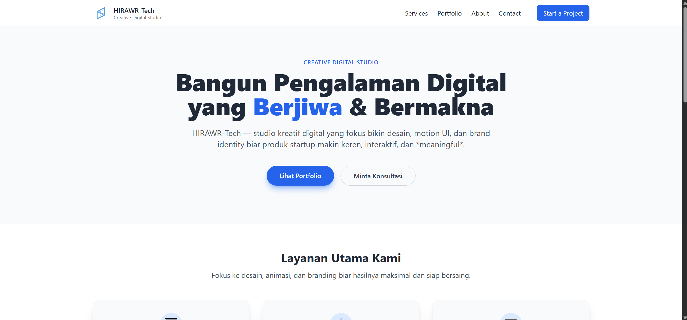
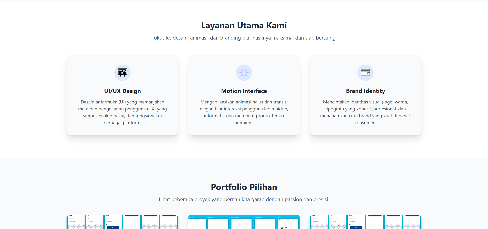
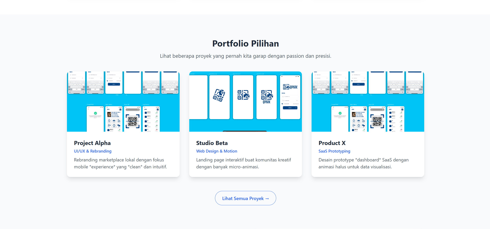
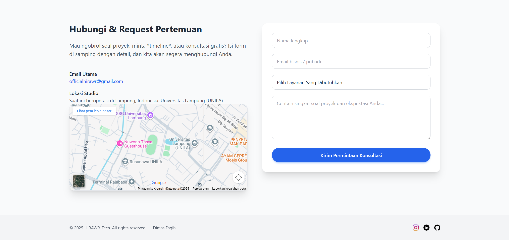
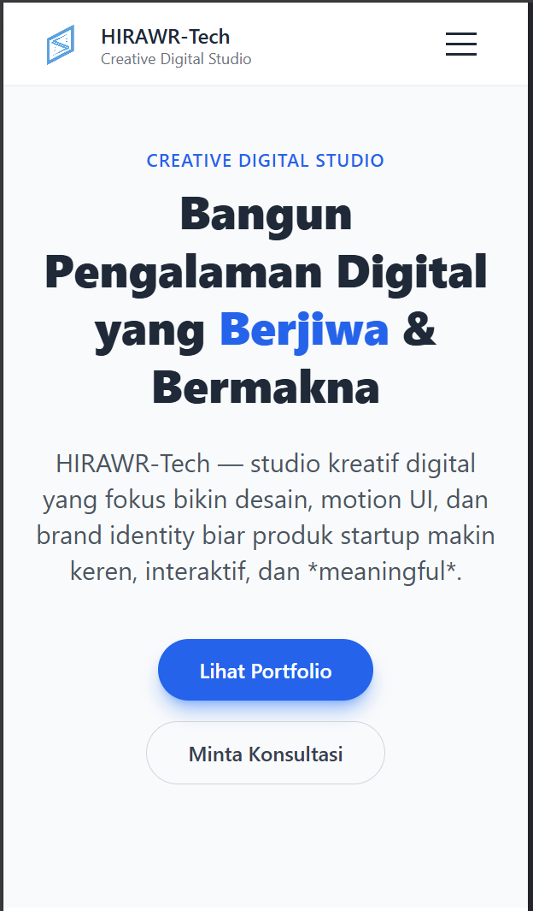
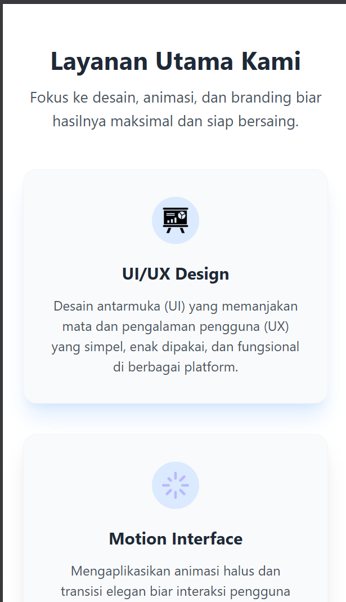
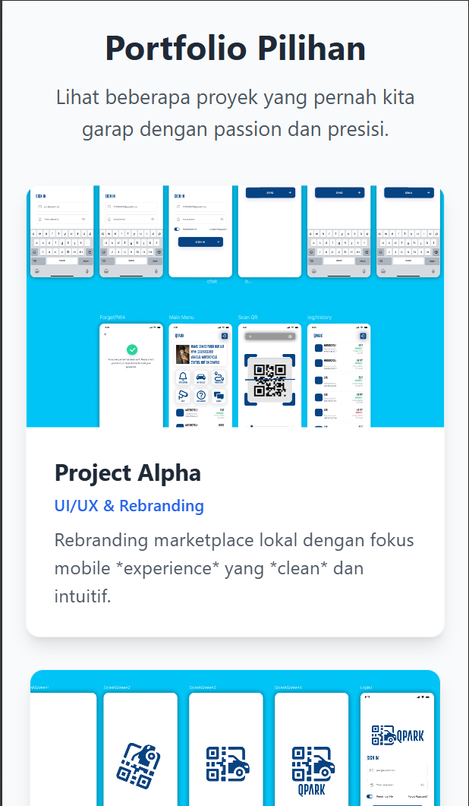
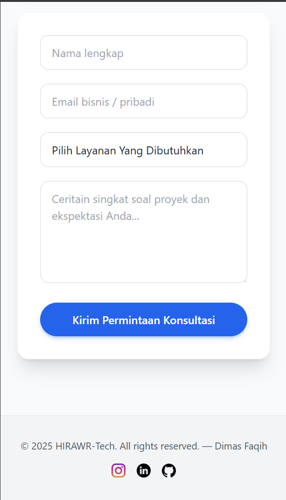
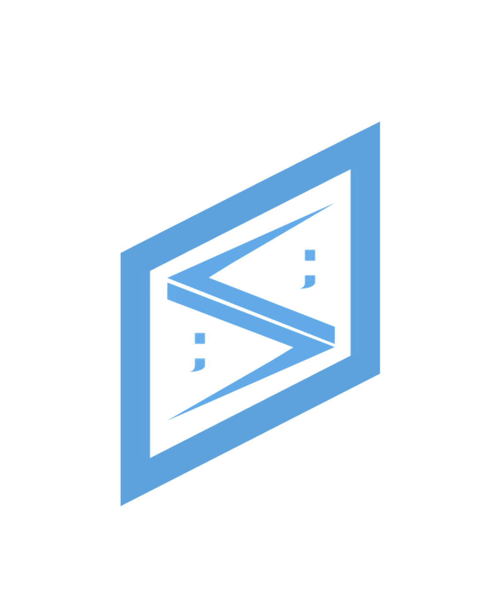

# ✨ HIRAWR-Tech — Creative Digital Studio (TUGAS AKHIR)

## 🚀 Deskripsi Proyek

Ini adalah *landing page* tugas akhir untuk **HIRAWR-Tech**, sebuah studio kreatif digital yang berfokus membangun **Pengalaman Digital yang Berjiwa & Bermakna**.

Kami fokus pada **desain**, **motion UI**, dan **brand identity** untuk membantu produk startup dan bisnis kreatif tampil lebih keren, interaktif, dan *meaningful*.

Website ini dibangun menggunakan **HTML5** dan **Tailwind CSS** untuk memastikan tampilan yang responsif dan modern di berbagai perangkat.

---

## 💻 Tampilan Website (Dekstop)

Berikut adalah beberapa *screenshot* tampilan utama dari website dalam mode dekstop:

### 1. Hero Section & Navigasi

Tampilan awal yang memperkenalkan studio dan ajakan utama: **Bangun Pengalaman Digital yang Berjiwa & Bermakna**.

### 2. Layanan Utama Kami (Services)

Bagian yang menjelaskan tiga fokus layanan utama: UI/UX Design, Motion Interface, dan Brand Identity.

### 3. Portfolio Pilihan

Menampilkan cuplikan proyek-proyek terpilih seperti **Project Alpha**, **Studio Beta**, dan **Product X**.

### 4. Hubungi & Request Pertemuan (Contact)

Bagian kontak yang memuat informasi email, lokasi studio (Lampung, UNILA), serta formulir permintaan konsultasi.

---

## 📱 Tampilan Website (Mobile)

Tampilan website juga dioptimalkan agar responsif dan mudah diakses melalui perangkat mobile.

### 1. Hero Section Mobile

### 2. Layanan Utama Mobile

### 3. Portfolio Mobile (Project Alpha)

Salah satu contoh detail proyek yang ditampilkan.

### 4. Formulir Konsultasi Mobile

Formulir yang disederhanakan untuk pengalaman pengguna mobile yang lebih baik.

---

## 🔗 Sosial Media

Kunjungi kami di platform lain:

* **Instagram:** [https://www.instagram.com/hirawr.store/](https://www.instagram.com/hirawr.store/)
* **LinkedIn:** [https://www.linkedin.com/in/dimas-faqih-nur-aulia-rohman-564437286/](https://www.linkedin.com/in/dimas-faqih-nur-aulia-rohman-564437286/)
* **GitHub (Developer):** [https://github.com/DIMFAQ](https://github.com/DIMFAQ)

 

  
   
   
  &copy; 2025 HIRAWR-Tech. All rights reserved. — Dimas Faqih

